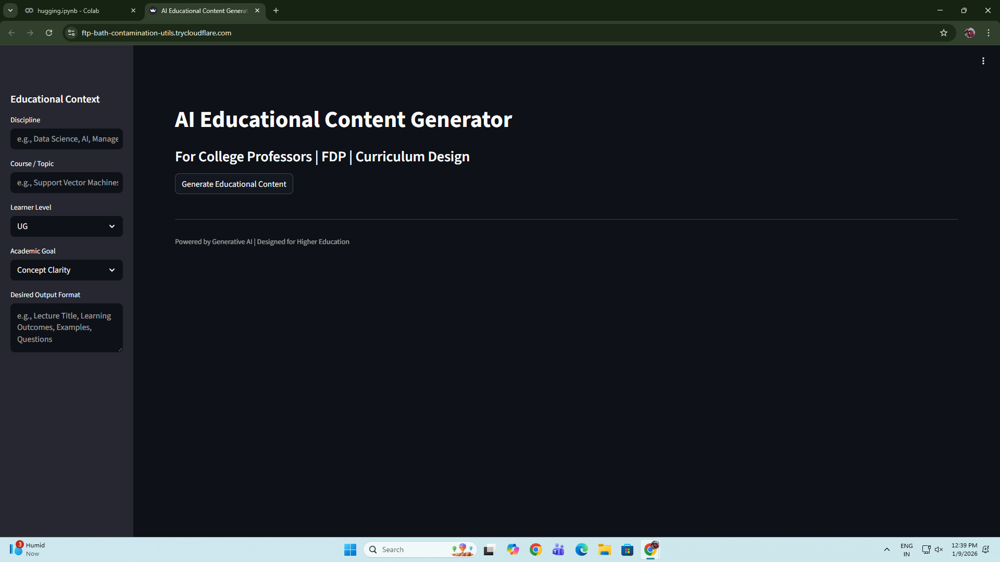
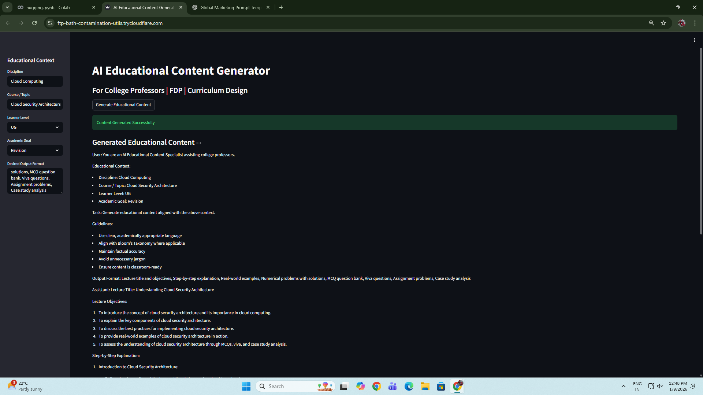

# AI Educational Content Generator

A production-grade AI platform for generating structured academic content for higher education.




---

## What This Does

An AI system that creates lecture-ready educational content based on:
- Discipline
- Course / Topic
- Learner Level
- Academic Goal
- Output Structure

Built using Microsoft Phi-3 Mini LLM.

---

## Key Capabilities

• Bloom’s Taxonomy aligned content  
• UG / PG / Diploma aware  
• FDP, curriculum and exam ready  
• Auto GPU/CPU selection  
• Classroom-ready outputs  

---

## How to Run Locally

```bash
pip install -r requirements.txt
streamlit run app.py
